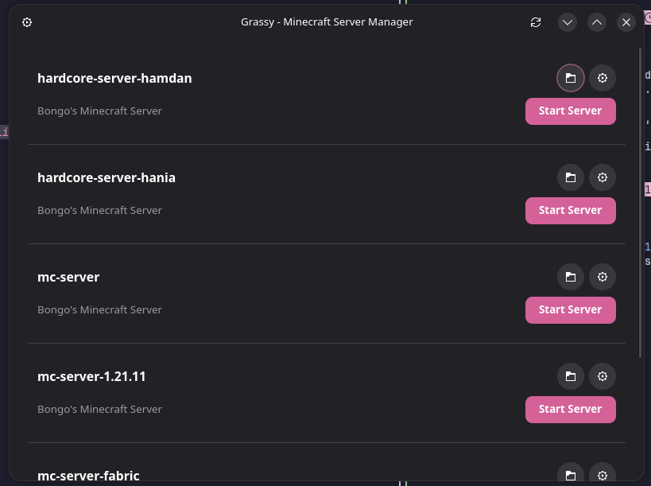
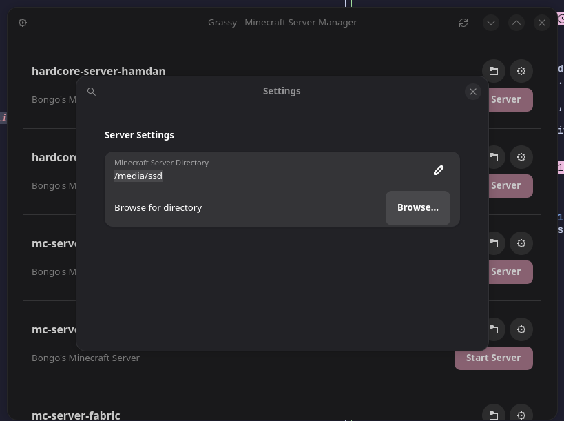
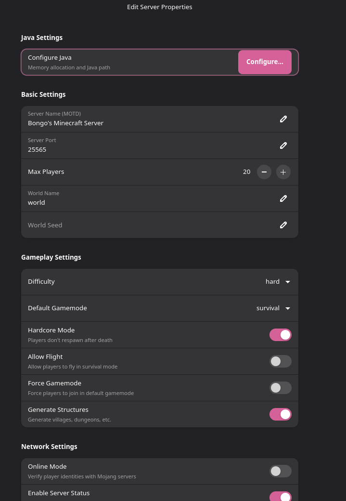

# Grassy
 A beautiful and easy-to-use Minecraft server manager built with Python and GTK4/libadwaita.

<p align="center">
  
</p>


### Downloading

Download the [latest version](https://github.com/mhashirshahzad/grassy/releases/latest)

<details>
<summary><b>📸 Screenshots (Click to expand)</b></summary>

### Main window


### Settings


### Server Settings


</details>

### Dependencies
Arch:

```bash
sudo pacman -S python-gobject gtk4 libadwaita gobject-introspection make
```
Fedora:

```bash
sudo dnf install python3-gobject gtk4 libadwaita make
```

Debian/Ubuntu:

```bash
sudo apt install python3-gi python3-gi-cairo gir1.2-gtk-4.0 libadwaita-1-0 make
```
### Development Running

```bash
git clone https://github.com/mhashirshahzad/grassy

cd grassy

make run
```


